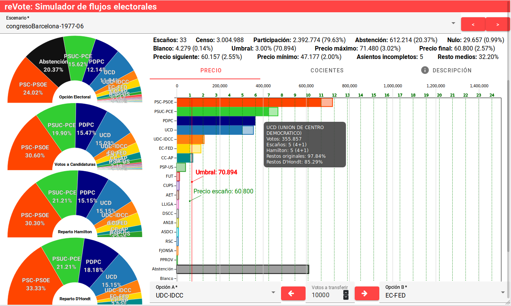

# Análisis Empírico con Simulador

## Objetivo

Explorar empíricamente cómo los trasvases de votos
entre dos partidos de un mismo bloque
afectan al resultado conjunto en escaños.

Partíamos de la expectativa ampliamente compartida
de que una mayor concentración de votos
en la candidatura mayoritaria del bloque
beneficiaría el resultado agregado.

Nuestro objetivo no era tanto comprobar esta creencia,
sino observar cómo se producía ese beneficio,
y bajo qué condiciones era más pronunciado.

## Hipótesis Inicial

Suponíamos que,  
a medida que aumentase la concentración
de votos en el partido mayoritario de un bloque,
los escaños conjuntos aumentarían.
No poníamos en duda esta relación,
que es una creencia extendida,
sino que queríamos explorar cómo se manifestaba en la práctica,  
observando el comportamiento del sistema frente a trasvases de votos.

## Procedimiento

Para verificar esta hipótesis,
utilizamos un simulador, desarrollado específicamente,
para realizar trasvases de votos entre partidos.
Los travases se realizaron entre pares arbitrarios de partidos,
incluso entre partidos sin afinidad ideológica,
con el fin de generar variabilidad en los resultados y descubrir patrones generales.
Se emplearon, como situaciones de partida,
datos reales de elecciones generales y autonómicas
en la circunscripción de Barcelona [^barcelona]
desde 1977, las primeras elecciones democráticas,
hasta 2011[^2011].
También se usaron datos sintéticos, con el fin de tener escenarios más controlados.

El simulador, que incluye los datos históricos y sintéticos,  
está disponible en votomitico.org.
tanto la versión original para escritorio[^envote],
como la versión online[^revote].

[^barcelona]:
    La investigación comenzó en un contexto activista,
    con el objetivo de promover el voto estratégico,
    y la circunscripción de Barcelona
    era el ámbito en el que podíamos intervenir.
[^2011]:
    Los datos históricos limitan hasta 2011
    porque fué en ese momento
    cuando se realizaron estos experimentos.
[^envote]: https://github.com/vokimon/envote
[^revote]: https://github.com/vokimon/revote

## Observaciones Iniciales

Al inicio, esperábamos que,
conforme se concentrara más apoyo en el partido mayoritario, 
los escaños conjuntos de ambos partidos aumentaran. 
Sin embargo, la simulación nos sorprendió,
ya que los resultados no siguieron este patrón esperado.

El simulador, que incluye los datos históricos y sintéticos,  
está disponible en votomitico.org.El simulador, que incluye los datos históricos y sintéticos,  
está disponible en votomitico.org.
## Patrones Observados

Según el escenario, se detectaron dos patrones diferenciados durante las simulaciones:

1. **Patrón Cíclico**:
    Como muestra la \autoref{fig:transfer-ab-updown},
    cada vez que la candidatura decreciente pierde escaños,
    lo gana primero una tercera candidatura, siempre la misma,
    y posteriormente la candidatura creciente lo recupera.
    Esto genera fluctuaciones cíclicas de un escaño en el resultado conjunto.
    El proceso es simétrico e independiente de la concentración.

    {#fig:transfer-ab-updown}

2. **Patrón Constante**:
    Como muestra la \autoref{fig:transfer-ab-flat},
    el intercambio se da de forma directa entre ambas candidaturas,
    sin cambio en el número de escaños conjuntos.
    Este patrón es más común en los casos sintéticos,
    pero también se da en algunos casos históricos.

    {#fig:transfer-ab-flat}

## Conclusiones

Los patrones encontrados contradicen la expectativa inicial de que,
concentrando el voto en el partido mayoritario,
los escaños conjuntos aumentarían.
En cambio, se observaron fluctuaciones cíclicas de un escaño
o una estabilidad en los escaños conjuntos.

Estos resultados nos permiten descartar
la hipótesis inicial como una regla general.
Sin embargo, debido a la naturaleza de la simulación, que cubre solo casos concretos,
no podemos descartar que, en escenarios no simulados,
pueda haber un aumento consistente
de los escaños conjuntos al aumentar la concentración.

Por otro lado, la simulación no proporciona
una explicación clara sobre los mecanismos subyacentes
que dan lugar a los comportamientos observados,
ni permite entender las diferencias en los patrones
entre los distintos casos.
Esto subraya la necesidad de adoptar enfoques más abstractos
que nos permitan explorar
tanto la generalidad
como las causas de los patrones observados.

